+++
date = '2026-08-10T15:04:53+08:00'
draft = true
title = 'Day11 Extra NVIDIA DPU 網路研究開發平台交流'
+++

DPU
- ASIC-based
    效能好彈性低 因為編成路徑都是事先設計好
- FPGA-based
    一定可編程性 但門檻較高
- SoC-based
    NVDA 主用 C++ 可編成性

data plane
control plane
軟體定義 硬體加速

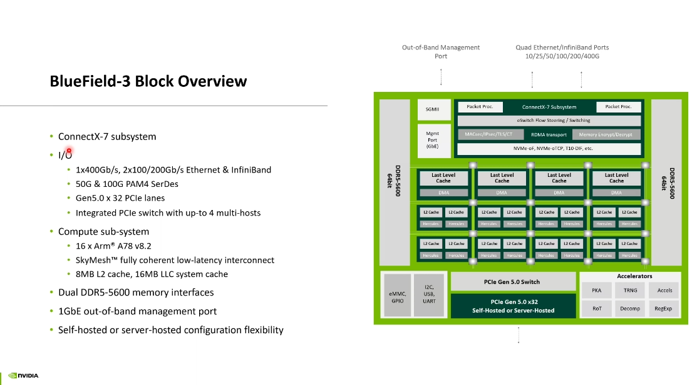

DPU架構
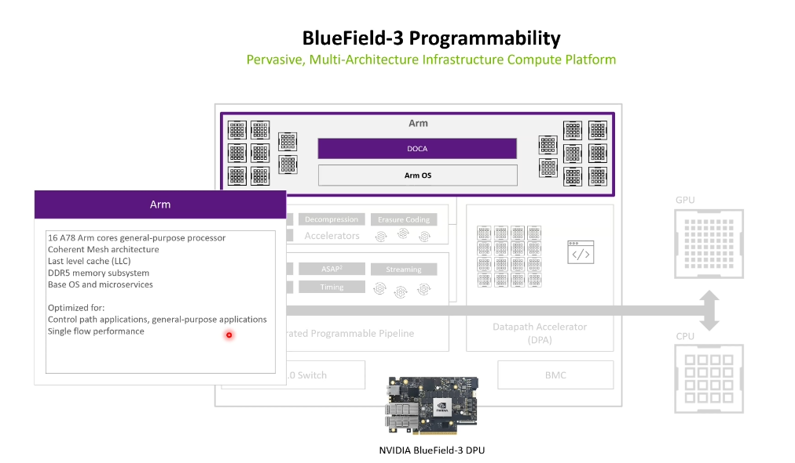
arm 處理器 一班應用跑上面比較彈性
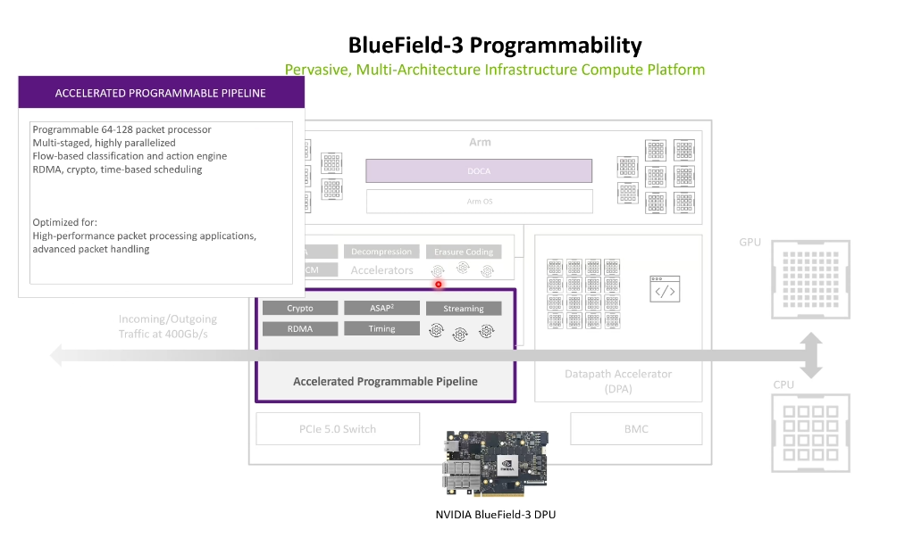
programmable 比較彈性
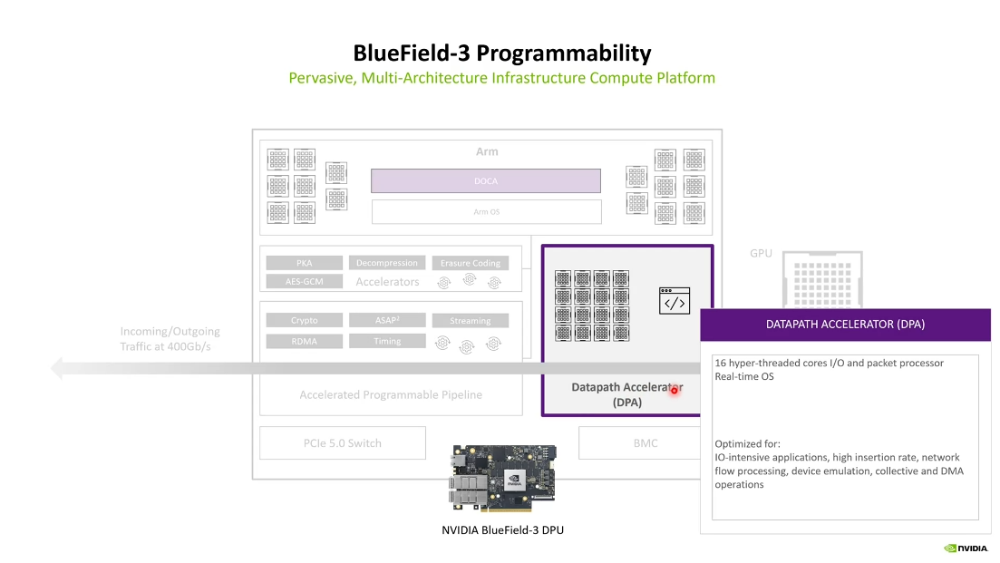
介於 arm核心 與硬體加速核心間
沒那麼彈性 但 C-PROGRAMMABLE比純硬體更彈性

硬體加速做不了 -> 給 DPA -> DPA 做不了 -> 給ARM 做

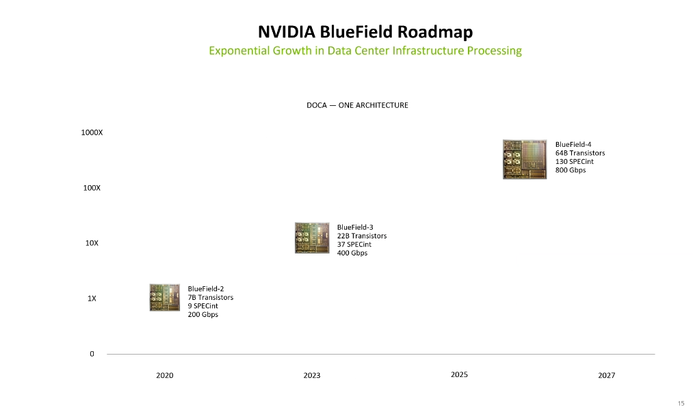
算力需求指數成長
非運算需求增加 (傳送packet 加解密)

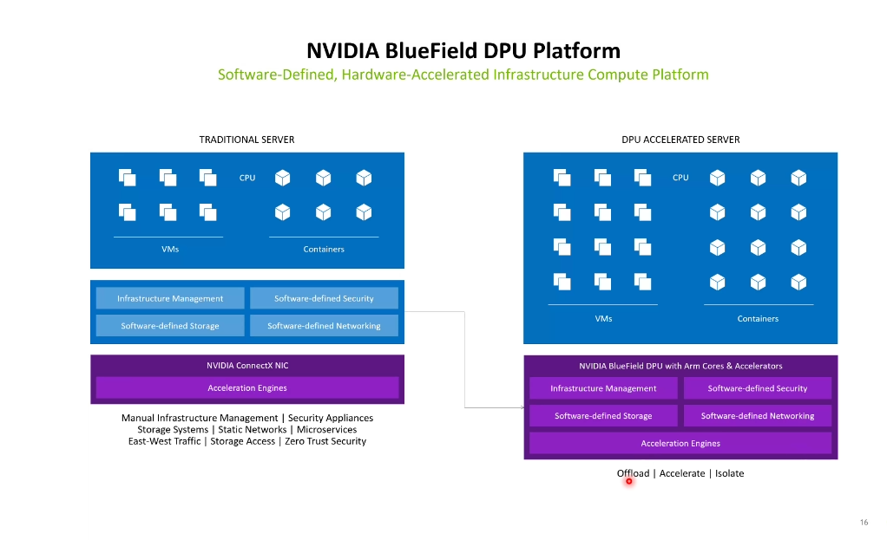

系統網路架構
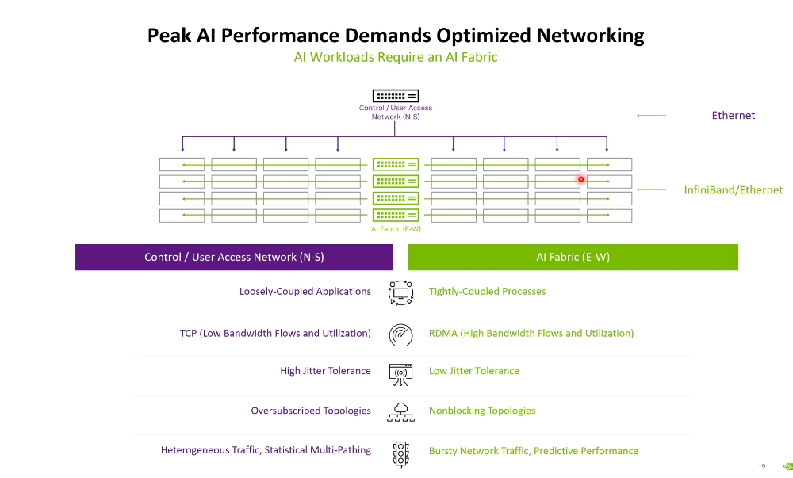
東西向 節點節點間 平行處理 需快
南北向
東西向南北向用不同方式通訊
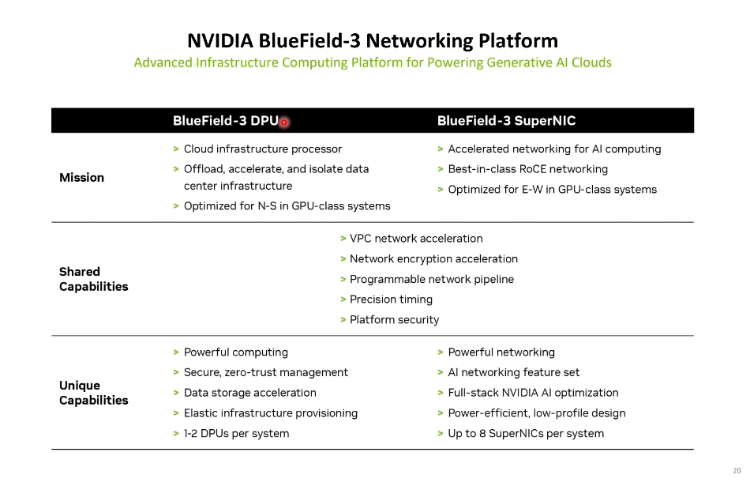
東西 superNIC 南北 DPU

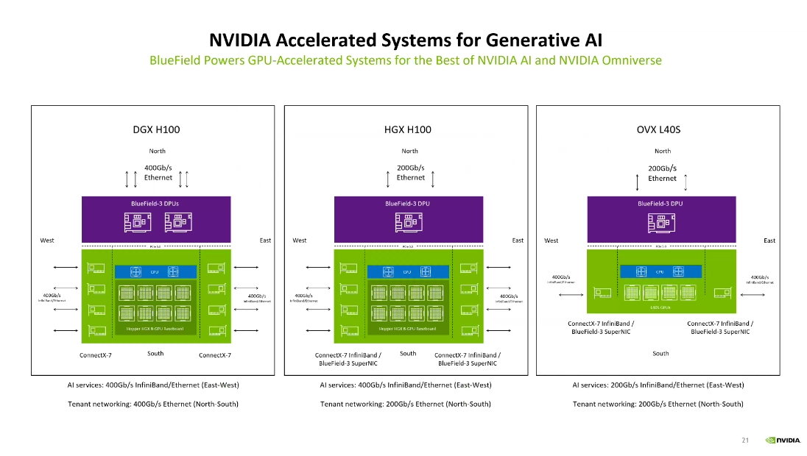

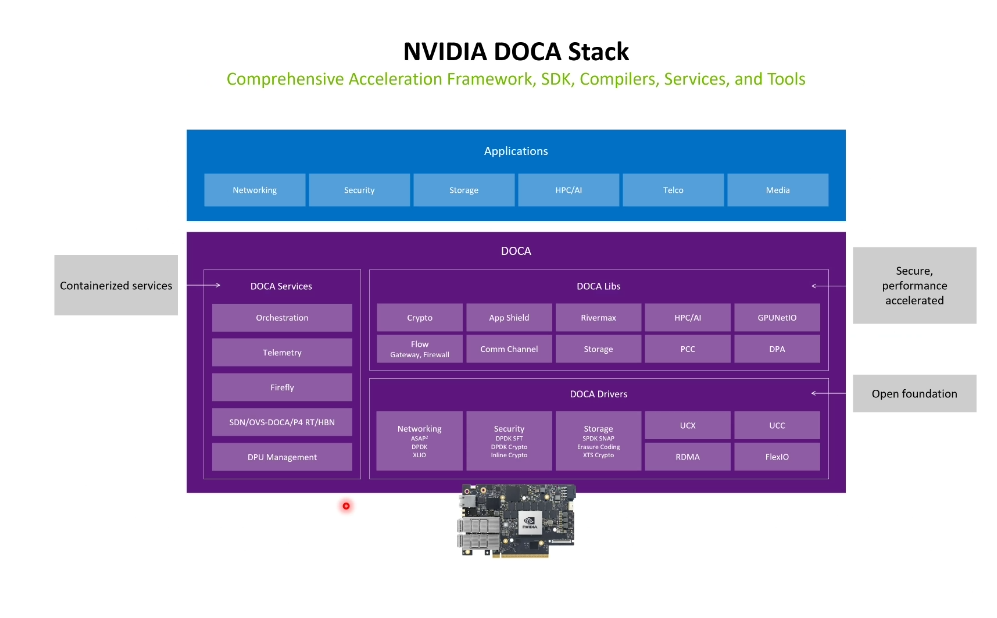
DOCA CUDA同等地位 CUDA加速 GPU DOCA 加速 DPU
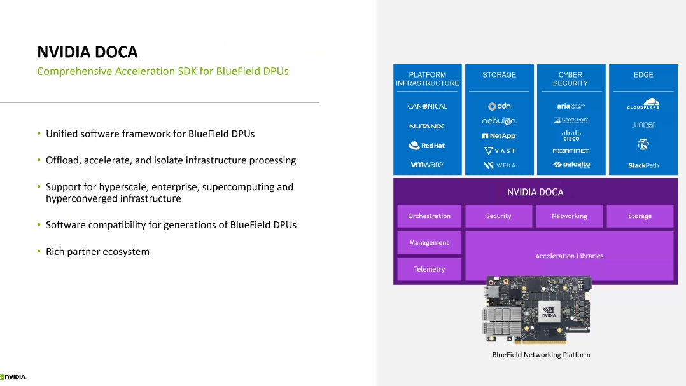
C-programmable 大量API方便快速搭建服務
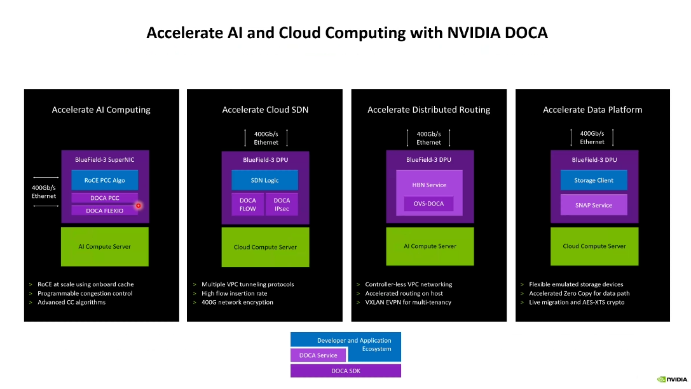

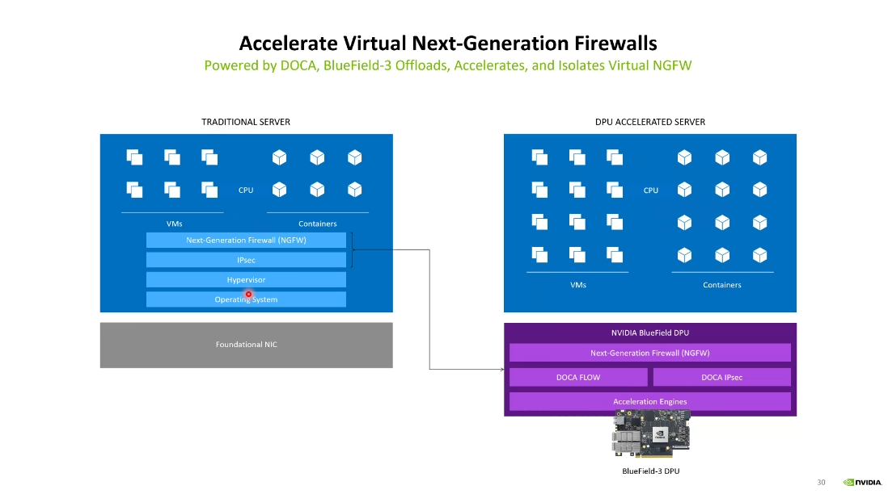
很多服務創建很多vm container 這些可以放DPU CPU專心處理 server之類的問題

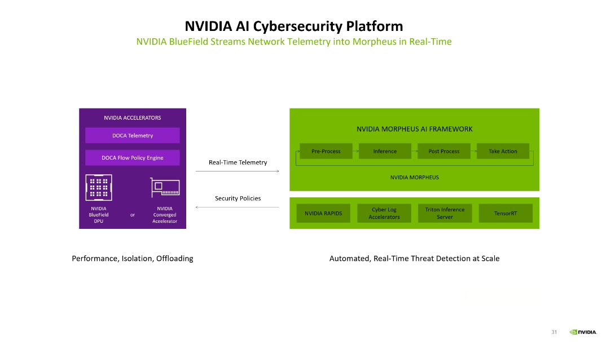
DPU 軟體定義加速 可programmable去定義security policy

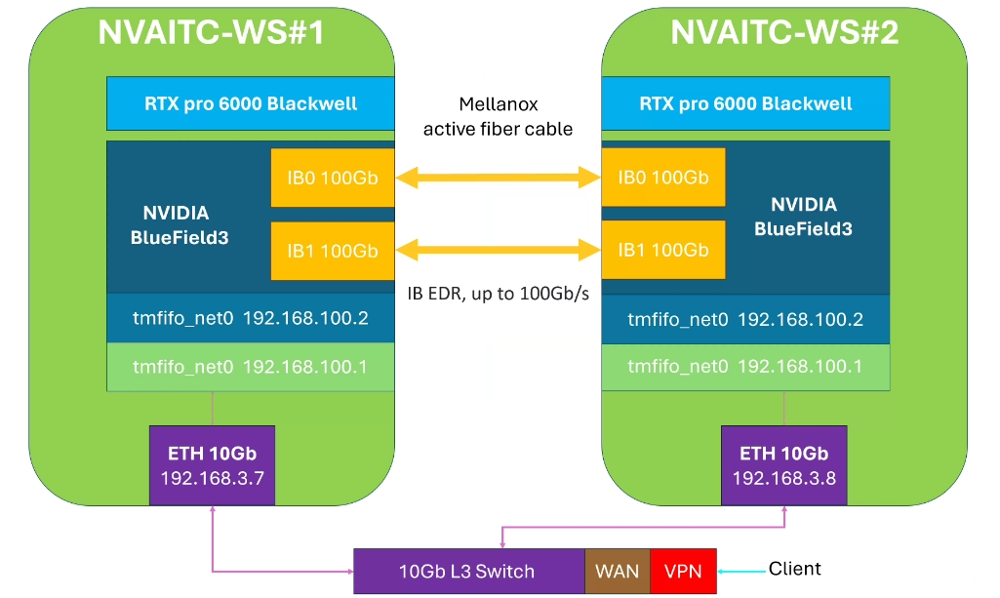
DPU平台 供合作夥伴使用