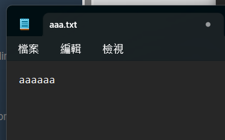
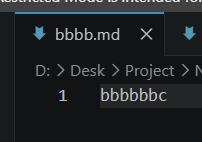

+++
date = '2026-07-15T13:47:10+08:00'
draft = false
title = 'Road to CS day2: linux basic (1/2)'
tags = ["linux"]
categories = ["linux"]
+++

  今天主要目標是複習linux的基礎，先把有關linux的常識過一遍，之後再開始學習更進階的知識。
  
  ## 1. command line

  ### 1-1. pwd (print working directory)
  可以顯示我們目前所在的目錄
  ```bash
  $ pwd
  /mnt/d/Desk/Project/NYCU_CS_0/road_to_CS
  ```
  - pwd -L (Logical)：顯示邏輯路徑（包含符號連結）。(預設)
  - pwd -P (Physical)：顯示實體路徑（解析所有符號連結）。  

  關於邏輯路徑與主題路徑的不同，可以看本文的[這個部分](#主題邏輯路徑與實體路徑的不同)了解    

  ---
  ### 1-2. cd (change directory)
  可以讓我們切換到不同的目錄，邏輯路徑或相對路徑都可使用。
  ```bash
  $ cd content
  /content$ cd posts/'day1 hugo_basic'
  /content/posts/day1 hugo_basic$
  ```

  這個指令有幾個特殊用法：
  - `cd ~` : 可以回到當前使用者的 `home/` 目錄
  ```bash
  $ cd ~
  ~$ pwd
  /home/wilson
  ```
  - `cd ..` : 可以回到當前的上一層目錄
  ```bash
  /content$ cd ..
  $
  ```
  - `cd -` : 表示回到上一頁
  
  此外也可以組合使用：
  ```bash
  /content$ cd ../public
  /public$
  ```

  ---
  ### 1-3. ls (list directories)
  可以列出當前目錄有哪些檔案，一樣可搭配邏輯路徑或實際路徑使用。
  ```bash
  $ ls
  LICENSE  README.md  archetypes  assets  content  data  hugo.toml  i18n  layouts  public  static  themes
  $ ls content
  posts
  ```

  當中有幾個常用參數：
  - `ls -a` : 列出被隱藏的檔案(.開頭的檔案)
  ```bash
  $ ls
  LICENSE  README.md  archetypes  assets  content  data  hugo.toml  i18n  layouts  public  static  themes
  $ ls -a
  .   .git     .gitignore   .hugo_build.lock  README.md   assets   data       i18n     public  themes
  ..  .github  .gitmodules  LICENSE           archetypes  content  hugo.toml  layouts  static
  ```

  - `ls -l` : 列出長資料串，包含檔案的屬性及權限等等
  ```bash
  $ ls -l
  total 4
  -rwxrwxrwx 1 wilson wilson 1086 Jul 14 00:09 LICENSE
  -rwxrwxrwx 1 wilson wilson   41 Jul 14 00:09 README.md
  drwxrwxrwx 1 wilson wilson 4096 Jul 13 22:24 archetypes
  drwxrwxrwx 1 wilson wilson 4096 Jul 13 22:24 assets
  drwxrwxrwx 1 wilson wilson 4096 Jul 14 10:41 content
  drwxrwxrwx 1 wilson wilson 4096 Jul 13 22:24 data
  -rwxrwxrwx 1 wilson wilson  106 Jul 13 22:26 hugo.toml
  drwxrwxrwx 1 wilson wilson 4096 Jul 13 22:24 i18n
  drwxrwxrwx 1 wilson wilson 4096 Jul 13 22:24 layouts
  drwxrwxrwx 1 wilson wilson 4096 Jul 15 13:47 public
  drwxrwxrwx 1 wilson wilson 4096 Jul 14 11:28 static
  drwxrwxrwx 1 wilson wilson 4096 Jul 13 22:25 themes
  ```

  當然這些參數也可以混合使用：
  ```bash
  $ ls -la
  total 4
  drwxrwxrwx 1 wilson wilson 4096 Jul 16 16:12 .
  drwxrwxrwx 1 wilson wilson 4096 Jul 13 22:24 ..
  drwxrwxrwx 1 wilson wilson 4096 Jul 15 13:39 .git
  drwxrwxrwx 1 wilson wilson 4096 Jul 14 00:02 .github
  -rwxrwxrwx 1 wilson wilson  161 Jul 14 00:01 .gitignore
  -rwxrwxrwx 1 wilson wilson  112 Jul 13 22:26 .gitmodules
  -rwxrwxrwx 1 wilson wilson    0 Jul 13 22:26 .hugo_build.lock
  -rwxrwxrwx 1 wilson wilson 1086 Jul 14 00:09 LICENSE
  -rwxrwxrwx 1 wilson wilson   41 Jul 14 00:09 README.md
  drwxrwxrwx 1 wilson wilson 4096 Jul 13 22:24 archetypes
  ...(剩下的我就不列全)
  ```
  
  ---
  ### 1-4. touch
  可以用來建立新的檔案，而要是檔案已存在的話，則會更新檔案的時間

  ```bash
  $ ls
  $ touch BRANDNEWFILE
  $ ls
  BRANDNEWFILE
  ```

  ```bash
  $ ls -l
  total 0
  -rwxrwxrwx 1 wilson wilson    0 Jul 16 20:41 BRANDNEWFILE
  $ touch BRANDNEWFILE
  $ ls -l
  total 0
  -rwxrwxrwx 1 wilson wilson    0 Jul 16 20:43 BRANDNEWFILE # 這裡檔案的時間被更新了
  ```

  --- 
  ### 1-5. file
  可以用來檢查檔案的格式
  ```bash
  $ ls
  'day1 hugo_basic'   day2   hello-world.md
  $ file day2
  day2: directory
  $ file hello-world.md
  hello-world.md: Unicode text, UTF-8 text
  ```

  ---
  ### 1-6. cat (concatenate)
  可以把檔案的內容呈現在螢幕上直接查閱

  今天我們先隨便建立 `aaa.txt` 和 `bbbb.md` 兩個檔案：
  
  

  此時就可以透過 `cat` 查閱檔案內容：
  ```bash
  $ cat aaa.txt
  aaaaaa$ cat
  ```
  此外也可以一次展示多個檔案：
  ```bash
  $ cat aaa.txt bbbb.md
  aaaaaabbbbbbc$
  ```
  
  ---
  ### 1-7. less
  而當檔案很大時，我們可以改用less來查閱，當文章行數大於螢幕可以呈現的行數時，它就會隱藏部分內容，而你可以向前向後翻頁，或是使用搜尋等功能。
  ```bash
  $ less a_large_file.md
  ```

  ---
  ### 1-8. history
  可以查看先前用過的指令：
  ```bash
  $ history
  ...
  1742  cat aaa.txt
  1743  cat
  1744  cat aaa.txt bbbb.md
  1745  rm aaa.txt bbbb.md
  1746  ls
  1747  cd posts
  1748  ls
  1749  cd day2
  1750  less index.md
  1751  history
  ```
  
  此外，執行 `clear` 可以清空螢幕。
  
  ---
  ### 1-9. cp (copy)
  複製檔案或目錄，具體用法為 `$ cp [source] [destination]`，例如：
  ```bash
  $ cp aaa.txt content/bbb.txt
  ```
  此外，若是目標檔案已經存在，則會覆蓋掉原先檔案的內容。

  當中有幾個常用參數：
  - `-r` (recursive): 如果複製的來源是一個目錄，則不只複製目錄，還連帶複製裡面的所有檔案。 
  - `-i` (interactive): 如果目標檔案已經存在，在覆蓋前會再詢問一遍是否執行。

  ---
  ### 1-10. mv (move)
  移動檔案或目錄，或者也可以用來替他們重新命名，用法與 `cp` 大致相同。
  ```bash
  $ ls
  aaa.txt
  $ mv aaa.txt bbb.txt
  $ ls
  bbb.txt
  ```

  稍微不同的地方在於，你可以移動大於一個檔案：
  ```bash
  $ mv aaa.txt bbb.txt /somedirectory # 這裡的意思是把 aaa 和 bbb 都移到某個目錄內
  ```

  當中有幾個常用參數：
  - `-i` : 和 `cp` 相同，在會覆蓋到其他檔案時先警告你。
  - `-b` : 在覆蓋到其他檔案時，為原先的檔案另做備份：
  ```bash
  $ ls
  aaa.txt  bbb.txt  posts
  $ mv aaa.txt bbb.txt -b
  $ ls
  bbb.txt  bbb.txt~  posts
  ```
  此時 `aaa.txt` 已經被改名為了 `bbb.txt`，而原先的 `bbb.txt` 則被備份在 `bbb.txt~` 中

  ---
  ### 1-11. mkdir (make directory)
  建立目錄，具體用法為 `$ mkdir dir1 dir2`  
  而搭配參數 `-p` 則可以建立多層目錄 `$ mkdir -p outer_dir/inner_dir/more_inner_dir`

  ---
  ### 1-12. rm (remove)
  可以移除目標檔案：
  ```bash
  $ rm file1
  ```

  當中有幾個常用參數：
  - `-r` : 和 `cp` 相同，不只刪除目錄，還連帶刪除裡面的所有檔案。 
  - `-i` : 和 `cp` 相同，在刪除前先警告你。
  - `-f` (force): 強制刪除，忽略不存在的檔案，不會跳出警告訊息

  此外，刪除目錄則是用 `rmdir` 指令

  ---
  ### 1-13. help
  提供一些 **bash shell 內建指令** (ex: echo, pwd, logout, etc) 的描述與用法等資訊：
  ```bash
  $ help echo
  ```
  ### 1-14. man (manual)
  提供指令設定檔。函數說明等等的詳細手冊：
  ```bash
  $ man ls
  ```
  ### 1-15. whatis
  提供指令的簡短描述，通常一句話就說完了：
  ```bash
  $ whatis cat
  ```

  ### 1-16. exit
  關機。

  ---
  ### 主題：邏輯路徑與實體路徑的不同

  - 邏輯路徑 (Logical Path): 使用者或程式存取檔案時看到的路徑	
  - 實體路徑 (Physical Path): 檔案在硬碟上的實際位置
  要實際比較這兩者的不同，我們可以建立一個情境：
  ```bash
  road_to_CS$ mkdir -p workspace/real_dir ## 先建立一個在 workspace/ 內的 read_dir/ 目錄
  road_to_CS$ ln -s workspace/real_dir shortcut ## 在外面建立一個名為 shortcut 的符號連結指向它 (road_to_CS->real_dir)
  ```
  此時我們相當於"邏輯上"建立了一個名為 `shortcut/` 的目錄，我們可以照常像使用一般目錄一樣使用它，但實際在硬碟上 `shortcut/` 的實際位置和 `/real_dir/` 是一樣的
  ```bash
  road_to_CS$ ln -s workspace/real_dir shortcut
  road_to_CS$ ls
  LICENSE    archetypes  content  hugo.toml  layouts  shortcut  themes
  README.md  assets      data     i18n       public   static    workspace
  ```
  我們對 `shortcut/` 的內容做任何操作也都會反映在 `real_dir/` 上。
  ```bash
  road_to_CS$ touch shortcut/1.txt
  road_to_CS$ ls workspace/real_dir
  1.txt
  ```
  而此時使用 `pwd` 搭配不同參數就能看出兩者的差別
  ```bash
  road_to_CS$ cd shortcut
  road_to_CS/shortcut$ pwd -L
  /mnt/d/Desk/Project/NYCU_CS_0/road_to_CS/shortcut
  road_to_CS/shortcut$ pwd -P
  /mnt/d/Desk/Project/NYCU_CS_0/road_to_CS/workspace/real_dir
  ```
  此外，在使用 `cd` 倒回到上一頁時，也會依照邏輯路徑與實體路徑的不同，退回到不同的位置。
  ```bash
  road_to_CS/shortcut$ cd ..
  road_to_CS$
  ```
  ```bash
  road_to_CS/shortcut$ cd -P ..
  road_to_CS/workspace$
  ```