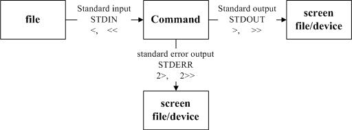

+++
date = '2026-07-18T19:44:15+08:00'
draft = false
title = 'Road to CS day3: linux basic (2/2)'
tags = ["linux"]
categories = ["linux"]
+++

  今天來學習一些資料與文字相關的東西。

  1. [**資料流重導向**](#1-資料流重導向)
  2. [**文字工具**](#2-文字工具)

  ## 1. 資料流重導向

  ### 1-1 資料流

  linux 裡面有一個很重要概念叫**資料流 (data stream)** ，它指的是程式與外界進行資料輸入 (input) 與輸出 (output) 的通道與流程。  

  linux遵循著一個核心精神：**｢一切皆檔案」**，意旨系統內無論是硬碟、周邊設備 (如滑鼠、鍵盤、印表機)、行程 (process) 還是網路連線，都可以被抽象化為檔案，使用讀寫檔案的方式來管理這些輸入輸出。  
  比如說今天有一個程式，它想要從我的鍵盤裡讀取我打入的訊息，則它應該像打開一個檔案一樣與鍵盤建立資料流，然後從鍵盤那邊 **read** 內容。同理，如果程式想要透過網路傳出一些訊息，它應該像打開一個檔案一樣與網路建立一個資料流，再向網路 **write** 內容。
  
  聽起來很抽象？確實，不過多操作幾遍你就會明白了。

  一般來說，當我們執行一份程式，linux 就會為程式先開好三個資料流：stdin、stdout 與 stderr。
  1. **stdin** (standard in): 代號0，程式預設讀取輸入的來源，通常對應到鍵盤
  2. **stdout** (standard out): 代號1，程式執行成功時預設輸出訊息的地方，通常對應到螢幕
  3. **stderr** (standard error): 代號2，程式執行失敗時預設輸出錯誤訊息的地方，和stdout一樣通常對應到螢幕。
    
  (當我們想要讀寫多個其他檔案時，也能再打開新的資料流，那些資料流的代號就是從3開始繼續遞增)

  具體舉例，當我們輸入 `$ echo Hello World` 時，實際上的運作過程就是：`echo` 從鍵盤讀取到 "hello world"，再把 "hello world" 輸出到螢幕上。
  
  ### 1-2. 資料流重導向
  關於資料流，有一個重要的技巧叫**資料流重導向**。  

  我們可以改變 stdin、stdout、stderr 的對應，讓他們不只對應到鍵盤或螢幕。
  - **stdout**: `>` or `>>`  
    
    當我們執行 `$ echo Hello World` 時，原先會將 "Hello World" 輸出到螢幕上，但假如今天改為執行 `$ echo Hello World > 1.txt` 呢？
    ```bash
    $ echo Hello World > 1.txt
    $ ls
    1.txt
    $ cat 1.txt
    Hello World
    ```
    可以看到，螢幕不再印出訊息，取而代之的是出現了名為 `1.txt` 的檔案，而檔案內正是我們輸入的 "Hello World"。  
    我們把 `echo` 的 stdout 重新導向到了 `1.txt`，讓它把輸出訊息寫到檔案內。

    ```bash
    $ echo Hello again > 1.txt
    $ cat 1.txt
    Hello again
    $ echo Hello World >> 1.txt
    $ cat 1.txt
    Hello again
    Hello World
    ```

    此外，若是目標檔案已經存在，使用 `>` 會覆蓋掉檔案內原先的內容，若是不想覆寫檔案，可以改用 `>>` 會改為在原內容的尾端附加上訊息。

  - **stdin**: `<` or `<<`  
    
    ```bash
    $ cat < 1.txt > 2.txt
    $ cat 2.txt
    Hello again
    Hello World
    ```
    上面這段指令，我們讓 `cat` 改為從 `1.txt` 讀取內容，再輸出到 `2.txt`

  - **stderr**: `2>` or `2>>`
    
    用法跟 stdout 基本一樣。
    值得一提的是 `2>&1` 可以把 stderr 重導向到目前 stdout 指向的地方。
    此外 `&>` 則是同時重導向 stdout 與 stderr的意思。

  此外要是有開啟其他資料流，需要重導向他們的話，只要依據他們的流向與代號去搭配字元就好了，比如新開了一個代號 4 的 istream 的話，就使用 `4<` 或 `4<<`。

  ---
  ## 2. 文字工具
  我們有很多工具可以對文件進行處理。範例文章如下：
  ```bash
  Alexander Thompson      engineer
  Christopher Mitchell    teacher
  Maximilian Richardson   taxi driver
  ```

  ### 2-1. cut
  `cut` 可以用來節錄文章的內容。  

  `cut -c 5 sample.txt` 會擷取出每行的第5個字元，此外如果要擷取一個多個字元，輸入類似 `5-8` 之類的數字範圍就可以了。
  ```bash
  $ cut -c 5 sample.txt
  a
  s
  m
  ```
  一行字會被分隔字元分成數段 (field)，而 `cut -f 2 sample.txt` 會擷取出每行的第二段，如第一行有 "Alexander Thompson", "engineer" 兩段，則第一行會擷取出的內容就是 "engineer"。
  ```bash
  $ cut -f 2 sample.txt
  engineer
  teacher
  taxi driver
  ```
  `d` 參數是用來搭配 `-f` 使用，一般來說每行的分隔字元預設是 '\t'(TAB)，但我們也能自行指定，如下面案例，我們輸入 `$ cut -d 'e' -f 2 sample.txt` 擷取每行的第二段，但我們指定了 'e' 為分隔字元，第一行實際上被分割為了 "Al", "xand", "r Thompson  ", "ngin", "r"幾段，擷取第二段就會得到 "xand"。
  ```bash
  $ cut -d 'e' -f 2 sample.txt
  xand
  r Mitch
  r
  ```

  
  ### 2-2. grep
  `grep` 的功能跟 `cut` 很像，只是 `grep` 是偵測關鍵字，把有關鍵字的那行整行抓出來
  ```
  $ grep 'and' sample.txt
  Alexander Thompson      engineer
  ```

  ### 2-3. head/tail
  `head/tail` 會列出文章的頭 n 行或者末 n 行，如果不用 `-n` 指定行數則預設 10 行
  ```bash
  $ head -n 2 sample.txt
  Alexander Thompson      engineer
  Christopher Mitchell    teacher
  $ tail -n 5 sample.txt
  Christopher Mitchell    teacher
  Maximilian Richardson   taxi driver
  ```

  另外 `tail` 還有一個功能，就是它可以即時監控檔案，只要輸入 `-f` 程式就不會結束，而是會持續「監控」目標檔案，只要檔案內容有甚麼變化，`tail` 就會把更新後的內容即時顯示出來
  
  ### 2-4. expand/unexpand
  我們先印出 `expand` 的執行結果：
  ```bash
  $ expand sample.txt
  Alexander Thompson      engineer
  Christopher Mitchell    teacher
  Maximilian Richardson   taxi driver
  ```
  看起來好像甚麼動作都沒有做，但是 `expand` 其實把文章中的 `\t`(tab) 通通換成一串 ' '(空白鍵) 了。
  反之 `unexpand` 則是把文中的一串空白轉成 `\t`(tab)。

  ### 2-5. join/split
  現在有兩篇文章：
  ```bash
  $ cat sample1.txt
  1 Jane
  2 Chain
  3 Mary
  ```
  ```bash
  $ cat sample2.txt
  1 Doe
  2 Man
  3 J
  ```

  `join` 會偵測，如果兩個檔案之中，有「相同資料」的那行，就把他加在一起，對於整理一些有格式、規律的文件非常有用。
  ```bash
  $ join sample1.txt sample2.txt > result.txt
  $ cat result.txt
  1 Jane Doe
  2 Chain Man
  3 Mary J
  ```
  `split` 在檔案太大時，可以用來分割檔案。
  在使用 `join` 前建議搭配 `sort`。

  ### 2-6. sort
  顧名思義，可以整理文件的每行，加上 `r`(reverse) 會變反向排序
  ```bash
  file1.txt
  dog
  cow
  cat
  elephant
  bird

  $ sort file1.txt
  bird
  cat
  cow
  dog
  elephant
  ```

  ### 2-7. uniq (unique)
  `uniq` 可以消除掉每行的冗餘：
  ```bash
  reading.txt
  book
  book
  paper
  paper
  magazine

  $ uniq reading.txt
  book
  paper
  magazine
  ```
  使用 `c` 可以計算重複出現的次數：
  ```bash
  $ uniq -c reading.txt
  2 book
  2 paper
  1 magazine
  ```
  使用 `-u` 可以只保留沒重複的內容：
  ```bash
  $ uniq -u reading.txt
  magazine
  ```
  使用 `-d` 可以只保留重複的內容：
  ```bash
  $ uniq -d reading.txt
  book
  paper
  ```
  但是當重複內容沒有靠在一起時，`uniq` 就偵測不出來
  ```bash
  reading.txt
  book
  paper
  book
  paper
  article
  magazine
  article
  
  $ uniq reading.txt
  reading.txt
  book
  paper
  book
  paper
  article
  magazine
  article
  ```
  所以在使用前建議搭配 `sort`。
  
  ### 2-8. paste
  `paste` 會把文章裡每行都黏在一起，並用分隔字元隔開
  ```bash
  $ paste -s sample.txt
  Alexander Thompson      engineer        Christopher Mitchell    teacher Maximilian Richardson   taxi driver
  ```
  也能夠搭配 `-d` 指定分隔字元
  ```bash
  $ paste -d '@' -s sample.txt
  Alexander Thompson      engineer@Christopher Mitchell   teacher@Maximilian Richardson   taxi driver
  ```
  ### 2-9. ni/wc
  `ni` 能用來替文章加上行數，`wc` 能盤點文章字數。
  ```bash
  $ cat sample.txt
  Alexander Thompson      engineer
  Christopher Mitchell    teacher
  Maximilian Richardson   taxi driver
  $ nl sample.txt
       1  Alexander Thompson      engineer
       2  Christopher Mitchell    teacher
       3  Maximilian Richardson   taxi driver
  ```

  ---
  ### 主題：pipe
  ...