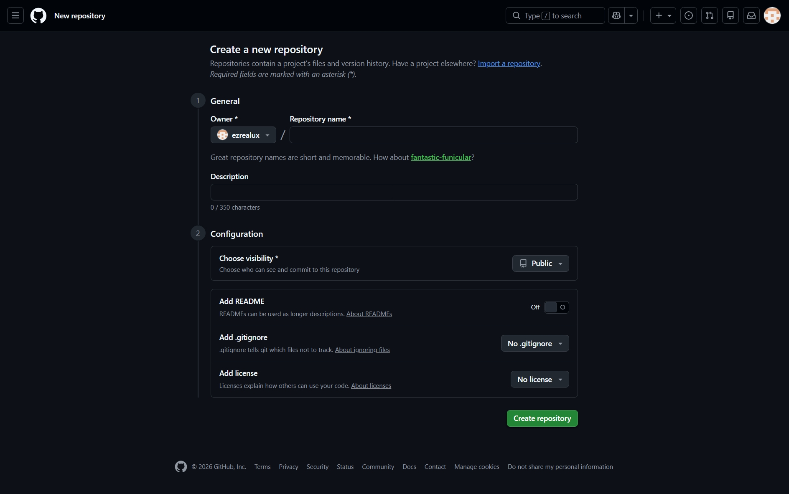
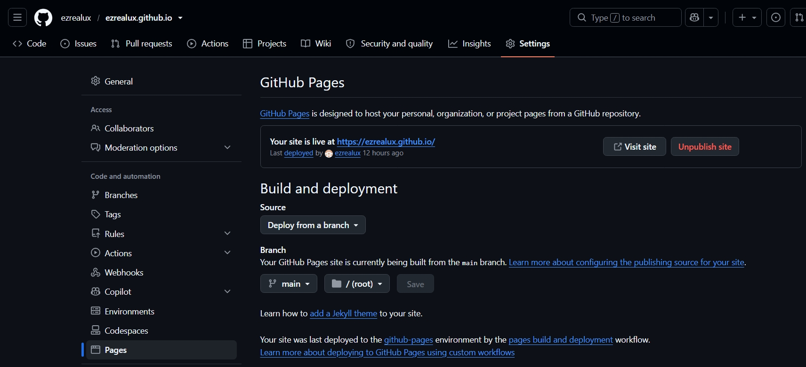
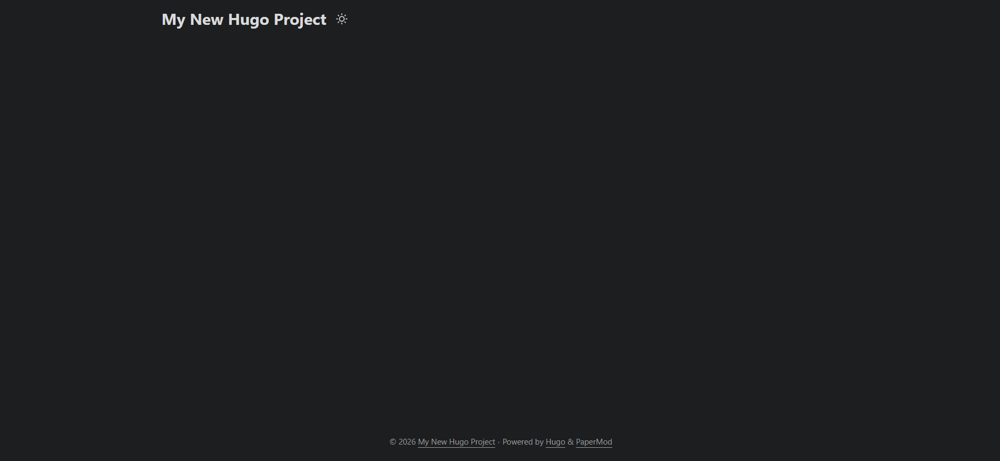

+++
date = '2026-07-14T10:41:32+08:00'
draft = true
title = 'Road to CS day1: hugo basic'
tags = ["hugo", "git"]
categories = ["hugo"]
+++

我用來撰寫部落格的工具是github pages搭配hugo框架。原因是這樣的話，我就能在撰寫部落格的途中順便熟悉git與github的用法。
主要可以分為幾個步驟：
  
  1. [**建立github repo**](#1-建立github-repository)
  2. [**搭建hugo框架**](#2-搭建hugo框架)
  3. [**部署到github pages**](#3-部署到github-pages)

---
## 1. 建立github repository  
  假設所有人都已經有github帳號了。，首先我們來到創建github repo的頁面：
    
  在這裡將repository name取名為 `[你的github帳號].github.io`、visibility設定為**public**、加入**README**跟**.gitignore**。  
  
  建立完成後來到repo的Setting頁面，選擇pages分類
    
  依照Source: **Deploy from a branch**、Branch: **main**、Folder: **/(root)**的方式設定，再按下save儲存。

  之後應該就能在頁面看到這樣的訊息：
  
  說明repo設定完成了。  
  我在建立repo後，所有的設定都已經預設好了，所以馬上就看到了訊息。如果沒有的話，或許就需要你手動設定，然後等待個幾分鐘。  

## 2. 搭建hugo框架  
### 2-1. 安裝hugo與git
  我的電腦用的是windows11作業系統，所以我安裝hugo的方法，就是執行：  
  ```powershell
  > winget install Hugo.Hugo.Extended
  ```
  安裝完成後輸入：
  ```powershell
  > hugo version
  ```
  確認hugo安裝完成，此外也別忘記安裝git
  ```powershell
  > git --version
  git version 2.44.0.windows.1
  ```
---
### 2-2. 建立專案
  要建立一個blog網站，首先我們需要建立一個專案資料夾：
  ```powershell
  > mkdir [目錄名稱] ## 建立專案目錄
  > cd [目錄名稱] ## 進入專案目錄內
  \[目錄名稱]> hugo new site . ## 建立專案
  ```
  完成後會看到目錄內的結構像這樣：
  ```
  archetypes/
  content/
  data/
  layouts/
  static/
  themes/
  hugo.toml
  ```
---
###  2-3. 引入主題
  搭建完專案的骨架後，我們可以為部落格挑選一個「主題」。所謂主題，指的就是網頁的風格，在hugo的官網，有許多前人早已設計好的模板，透過引入這些模板，我們便能省去前端設計的心力，專注在文章內容上。這次我選用了PaperMod主題。
  
  而從這裡開始，就要開始搭配git了。
  首先我們先執行：
  ```powershell
  > git init
  ```
  把目前的這個專案資料夾初始化成git repo，這樣才可以進到下一步：
  ```powershell
  > git submodule add https://github.com/adityatelange/hugo-PaperMod.git themes/PaperMod
  ```
  `git submodule` 可以讓我們把另一個repo作為子目錄嵌入我們自己的專案repo中，透過這樣，我們成功引入了前人設計的hugo主題而不使專案結構過於臃腫。

  而引入hugo主題的程式碼之後，我們也要修改設定檔，來讓我們開始使用主題。我們需要打開 `hugo.toml` 把內容改成：
  ```toml
  baseURL = "https://[github帳號名].github.io/"
  languageCode = "zh-tw"
  title = "[部落格標題]"

  theme = "PaperMod"
  ```
  這樣一來就確立了，這個部落格專案使用的是PaperMod主題。而此時若是輸入：
  ```powershell
  hugo server -D
  ```
  看到 `Web Server is available at http://localhost:1313/` 的內容，說明網頁在你的本機開始運行了，此時點進網址，應該就能夠看到類似這樣的畫面：
  
  (發現暗色模式害我的網頁預覽圖完全融入背景了，我真是個天才)  

## 3. 部署到github pages

